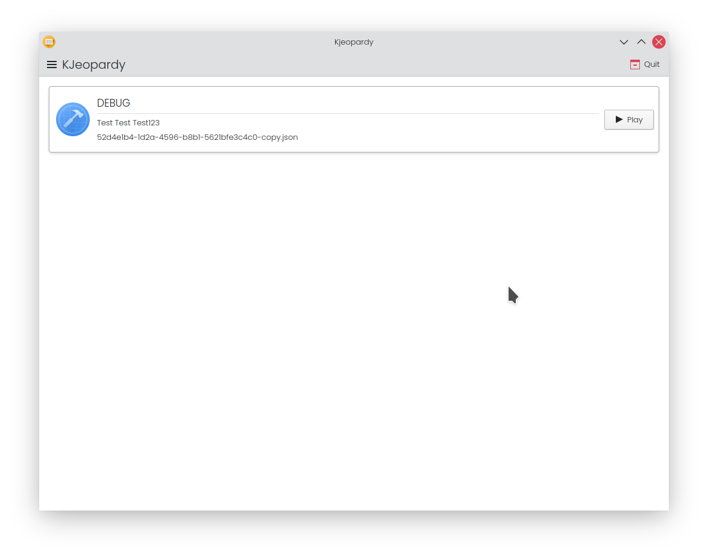
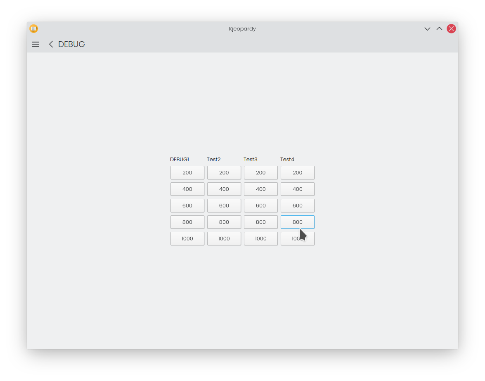

# KJeopardy
This is an opensource jeopardy application written in Python with KDE Frameworks 5. It is **not** an official KDE application.

## Screenshots

## Adding jeopardys
will be documented soon
